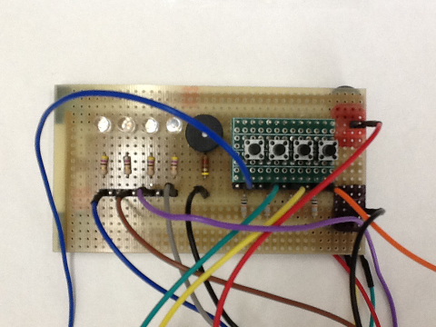
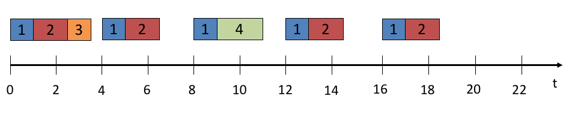

## Objectives

In Lab 1 you learned how to use the `delay()` function to coordinate some actions at specific intervals. As useful as the `delay()` function was; it only serves to pause the program which in reality halts the `loop()` function. This has for effect to put the processor in a wait state; which similarly to a spinlock is wasteful. Interrupts are useful as they allow us to momentarily suspend the execution of the `loop()` software, go perform some action(s) within an Interrupt Service Routine (ISR) and resume execution of `loop()` without losing clock cycles. This lab is an introduction to using timers to control the flow of a real-time application with multiple tasks.

In the first part of the lab, you will learn how to:

- Initialize the registers of timers that are available with your Arduino.
- Write an ISR that uses the timer interrupts to perform some actions. In this first part of the lab you will be toggling the LEDs on your board on and off.

In the second part of the lab, you will implement different scheduling mechanisms based on the policy that is given to you in the lab instructions.

## Introduction

The Arduino Mega 2560 has six timers that can be used to generate interrupts at programmable intervals. Timer 0 and 2 are eight bit timers while Timers 1,3,4 and 5 are 16 bit timers. When using timers, we have to be aware that the Arduino's designers have also used timers to implement the Application Programming Interface. When using libraries provided by other parties, one also has to be aware of any interrupts or timers used as part of the library before designing a solution. The timers are used by the following functions of the Arduino API:

1. Timer0 used for `delay()`, `millis()` and `micros()`
2. Timer1 used for the `Servo()` library.
3. Timer2 used for the `Tone()` library.
4. Timers 3, 4 and 5 are not linked to any library which we are currently concerned about.

The timers are also mapped to pins for Pulse Width Modulation (PWM). We are not using PWM in this lab so we need not worry. If you were using PWM in other projects along with timers, you would need to research this.

In this lab we will be using Timers 1, 3, 4 and 5. We will not be using the `Servo()` library so using Timer1 will not cause us any problems.

In order to have full control over the hardware, we will be using the register of the Arduino 2560 directly, the processor is an [Atmel ATmega2560/V](http://www.atmel.com/images/atmel-2549-8-bit-avr-microcontroller-atmega640-1280-1281-2560-2561_datasheet.pdf), refer to the datasheet if you do not find the information that you think you need and that is not included in the lab instruction. The use of timers requires a detailed knowledge of the hardware you are using that is normally hidden by the Arduino API.

Before setting any Timer registers, you are required to [disable the interrupts](https://www.arduino.cc/en/Reference/NoInterrupts).

Timers have control registers allowing to reset, clear flags, preload values and prescale. You need to understand the purpose and the functionning of each register. Here we only list the registers and bits that are needed for the lab, there is a lot more in the documentation.

- TCCRx - Timer/Counter Control Register. The x stands for the number of the timer, 0..5. This register has two control words, TCCRxA and TCCRxB/
	- The TCCRxA controls the Output Compare Mode for both the PWM and non-PWM modes. It also controls the Waveform Generation Mode (WGM). In this lab we will not use these modes so you need to initialize each TCCRxA to 0. For example for Timer 1 you would have `TCCR1A = 0;`
	- The TCCRxB controls the setting of the WGM mode for TCCRxA which we will not use. What is important to us is that this register controls the prescaler for each timer through the setting of three Clock Select bits CSx0, CSx1 and CSx2, i.e. TCCR1B is the prescaler for Timer 1. The prescaler allows you to divide the clock in order to have a longer period between interrupts.
	- In order to ensure that we have our desired mode of operation, we must initialize B to 0: `TCCR1B = 0;`
- TCNTx - Timer Count Register for timer x. In this register you preload the value of the counter to start from. We could start counting from 0, but as we will see it is sometimes better to start counting from a non-zero value to have more control on the timer interrupt.
- TIMSKx - Timer Interrupt Mask Register, this registers allows us to determine what kind of interrupt we want our timer to generate. There are three bits in this register, two of them control the Output Compare Match function of the register, the bit we are interested in is the Timer Overflow Interrupt Enable bit or the TOIEx bit.

### Libraries

You must include the following libraries in your code.

- avr/io.h
- avr/interrupt.h

### Prescaling

The clock for the Arduino Mega 2560 is a 16MHz clock. So the clock could potentially provide you with 16 million "counts" per second, quickly overflowing the registers causing frequent interrupts. Although this could be useful for some applications, most programs will require a longer period between interrupts. The Atmel ATmega2560/V microcontroller allows us to program our timers to have different frequencies. As well, there are several ways to control the behaviour of the timers.

Let us first consider the *Prescaling* of timers. We can program a timer to accumulate hardware clock pulses before they increase their count instead of doing it every clock pulse. For example, I could program my timer to get 256 pulses from the clock before I increase the counter in my timer. So if I divide the clock speed by the prescaler: 16 000 000 / 256 = 62 500 counts per second.

### Setting up Prescale Register TCCRxB


| CSx2 | CSx1 | CSx0 | Description 									|
| ---- | ---- | ---- | ----------- 									|
|  0   |  0   |  0   | Aucune horloge source - chrono arrêté		|
|  0   |  0   |  1   | Horloge / 1 - aucune échelle					|
|  0   |  1   |  0   | Horloge / 8 du génateur d'échelle			|
|  0   |  1   |  1   | Horloge / 64 du génateur d'échelle 			|
|  1   |  0   |  0   | Horloge / 256 du génateur d'échelle			|	
|  1   |  0   |  1   | Horloge / 1024 du génateur d'échelle			|
|  1   |  1   |  0   | Horloge externe - broche 1 front descendant	|
|  1   |  1   |  1   | Horloge externe - broche 1 front montant		|

There are a few methods to load the TCCRxB register with the prescaler:

```c
TCCR1B |= (1 << CS12);
```

load CS12 of TCCR1B with 1 using logical shift left : 100, 256 prescaler

or

```c
TCCR1B |= (1 << CS12) | (1 << CS10);
``` 

load CS12 and CS10 with 1 : 101, 1024 prescaler

or

```c
TCCR1B = 0x05;
```

first three bits are CS10 to CS12 : 101, again 1025 prescaler

### Pre-loading

In the previous example given in prescaling, we have a register that will count 62 500 pulses a second. To get a 1Hz interrupt, we would want to get an interrupt after those 62 500 pulses. However, Timer 1, 3, 4 and 5 are using 16 bit registers which counts $2^16 = 65 536$. Our interrupt would only occur another 3036 pulses (65536-62500) after our required 1 Hz. More precisely, our interrupt would occur every 1.00486 seconds so if we want to reach a count of 65 536 within a second, we cannot start counting from 0 but rather from 3036. i.e. `TCNT1 = 3036;`. **Important:** you need to reload the register within the Interrupt Service Routine.

The above example would produce an interrupt every one second. For a higher frequency using the same prescaling we divide the clock further by the desired frequency to recalculate a new pre-loading number. For a 16 bits timer and a clock speed of 16 Mhz the number of interrupts per second = 65536 - (16 000 000/scale/frequency).

- So for a 2 Hz signal we would have 65536 - (16 000 000 / 256 / 2) = 34286. This means that we start counting at 34286 instead of 3036 which will give us our interrupt a lot sooner.
- For longer period interrupts you may need to use a 1024 prescaler.

### Interrupt Mode

All that is left to do is now to set the interrupt mode for our Timer register. There are many ways to work the timers, PWM, Output Compare Mode, Waveform Generation Mode and overflow mode. What we will use for this lab is the overflow mode. When a timer counter reaches its maximum value (for a 16 bit counter 65535) the counter will overflow and trip the overflow flag. This is the event we want to capture for our timer interrupts. To do so, you must initialize the Timer Interrupt Mask Register TIMSKx and set the Timer Overflow Interrupt Enable bit to 1:

```c
TIMSK1 |= (1 << TOIE1);
```

which sets the Timer for Overflow interrupt

### Interrupt Vectors

Once your timers are set to cause interrupts at certain frequencies, you must write the Interrupt Service Routines (ISRs) The ISRs for the Timers are functions that are called by the hardware. Each overflow timer vector has the form:

```c
// ISR Vectors

ISR(TIMERx_OVF_vect) // replace x by the proper timer
{
	// Put your code here

}
```

## Part 1 - Timer Based Output at Various Frequencies

Create a new project and name it something like part1_partnerName1_partnerName2.ino. In this first part you are to create four different timers using Timers 1, 3, 4 and 5. Each ISR for overflow timers must toggle the four LEDs.

We will use the same setup as for lab 1. So plug in the ground and the power on the GND and VCC ports respectively. Then plug the diodes on the digital ports 22, 24, 26, 28 using wires and connectors available in the lab.



Implement the following requirement:


| Timer  | LED  | Frequency |
| ------ | ---  | --------- |
|   1	 |  22  |   10 Hz   |
|   3    |  24  |    1 Hz   |
|   4    |  26  |   0.5 Hz  |
|   5    |  28  |  0.25 Hz  |

## Part 2 - Timer/Clock Scheduling

Create a new project and name it something like part2_partnerName1_partnerName2.ino. In this part you will be implementing a Timer/Clock Driven Scheduler. Specifically you are to find and implement a non-preemptive schedule for the following task set &#964;<sub>1</sub>= (4,1), &#964;<sub>2</sub>= (5,1.5), &#964;<sub>3</sub> = (20,1) , &#964;<sub>4</sub> = (20,2), where the times are in seconds. We came up with the following fixed schedule that you must implement.



Each task turns on its respective LED, i.e. task 1 turns on LED 1 on pin 22 ... and task 4 turns on LED 4 on pin 28. The LED stays on for the duration of the task, i.e. task 1 turns its LED on when it starts and one second later when it finishes, it will turns it off.

Note that the function `digitalWrite()` only requires a few micro-seconds to execute so it will not fill the time slot. In order for the task to have the specified duration, you will need to put a delay between LOW and HIGH. However, the `delay()` function or the `millis()` functions do not work when any kind of timer is enabled. So to create your delay, you need to use a loop; 1 000 000 iterations in a loop will give you about 1 second. Because of some compiler optimization, a loop will be ignored if you use a normal variable as the loop counter. You need to use the `volatile` modifier. Be also careful of the maximum value that can be represented by a given variable type.

## Part 3 - Priority-Based Non-Preemptive Scheduling

In this part you will create a non-preemptive priority-based dynamic scheduler. This means that once a task is given the processor it runs to completion. We will assume that no blocking for resources is possible. A task will only block when it is waiting for its next execution.

You are to implement the following:

1. A typedef struct called `tskTCB` that includes a task's priority, period, max execution time, and remaining tics.
2. A ready queue in the form of a linked list
3. A blocked queue for when the tasks delay themselves; also in the form of a linked list
4. A `sleep()` function that the tasks can call to delay their next release.
	- Each time a task executes it calls the `Sleep()` function to delay itself a number of ticks (50ms).
	- The function moves the node from the ready queue to the blocked queue.
5. A clock tick ISR that runs every 50ms.
	- Each time the clock tick ISR runs, it inspects the blocked queue updates the next release time of each task by decrementing the remaining ticks.
	- If the number of remaining ticks is 0 after the update, the ISR moves the node to the ready queue.
	- When all the nodes of the blocked queue have been updated and the appropriate tasks have been moved back to the ready queue the ISR calls the scheduler.
6. A priority-based scheduler that runs every clock tick, as it is called by the clock tic ISR.
	- the scheduler is to inspect the ready queue and select the next highest priority task to run.
7. Use the same task set as in Part 2.
8. Your scheduler must be generic enough that if a new set of tasks was given, it could handle it.

## Part 4 - Dynamic Priority Preemptive Scheduling

**More directions will be provided during week 2. Start this part of the lab at your own risk. Requirements may change**

Expend on the scheduler you created in the previous part so that it supports preemption and it calculates the priority of tasks dynamically according to the EDF* algorithm seen in class.

The tasks that are to be implemented for this part are the same as for part 3 in addition to the following:

- A task that reads the provided temperature sensor every 10 seconds.
- A task that displays the temperature on the LCD. Use 
- A task that handles one of the pushbuttons on the test board so that it toggles the display between Celcius and Fahrenheit. Use interrupts for the button.

Select the appropriate periods, execution time, deadlines and precedence for each of the new tasks. Include your rational in the lab report. Also provide a schedulability analysis.

In order to implement preemption, you will need to save the context of the executing task. This involves saving registers, which can only be done with assembly. To get an idea of how it can be done, have a look at the [FreeRTOS port for Arduino](https://create.arduino.cc/projecthub/feilipu/using-freertos-multi-tasking-in-arduino-ebc3cc).

To implement an interrupt-driven input, you will need to use one of the interrupt enabled pin on the Arduino. The Mega 2560 has 6 of them: 2, 3, 18, 19, 20, and 21. We recommend you try the interrupt to turn on one of the LED before integrating into the bigger program. Beware of bouncing of the pushbutton as it will trigger multiple interrupts.

## Lab report

Your lab report should include a cover page, a brief introduction, discussion and conclusion.

Your discussion should explain your design using appropriate diagrams (UML, precedence, schedule, etc.) when necessary.

Use the following format for your [report]({{ "/assets/docs/lab-report.docx" | absolute_url }}).


### Submission

You must submit your lab report in *PDF* format and your code by e-mail in a *.zip* file.